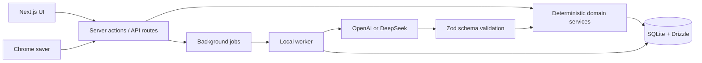

<div align="center">
  <h1>JobPilot</h1>
  <p><strong>A local-first workspace for finding jobs, tailoring resumes, and managing every application.</strong></p>
  <p>
    <a href="README.zh-CN.md">简体中文</a>
    ·
    <a href="https://try-jobpilot.vercel.app">Live app</a>
    ·
    <a href="#quick-start">Quick start</a>
    ·
    <a href="#privacy-and-ai-boundaries">Privacy</a>
    ·
    <a href="CONTRIBUTING.md">Contributing</a>
  </p>
  <p>
    
    
    
    
    
  </p>
</div>


JobPilot is an open-source, single-user job-search web app that keeps the candidate in control. Import or build a resume, describe several independent job targets, discover and assess roles, tailor application materials, prepare for interviews, and track the full application timeline in one workspace.

It works as a useful resume editor and application tracker without AI. When AI assistance is enabled, all model calls go through the JobPilot backend and produce structured suggestions that are validated before the application writes anything.

> [!IMPORTANT]
> JobPilot is under active development. Back up the `data/` directory before upgrading, and review every AI-generated claim before using it in an application.

> [!NOTE]
> The public `main` and `cloud` release branches are published from the same source tree so product features stay aligned. `main` runs in local-first, single-user mode; `cloud` powers the [hosted JobPilot app](https://try-jobpilot.vercel.app) by enabling Supabase authentication and private storage, hosted libSQL, encrypted per-account model keys, tenant-isolated queues, and a bounded Vercel worker through deployment configuration. See [Cloud deployment](docs/CLOUD_DEPLOYMENT.md).

## Product Scope

The release path is intentionally narrow:

1. create or import a factual resume;
2. define one or more independent job targets;
3. discover or save a role and assess it;
4. review resume and cover-letter suggestions claim by claim;
5. track the application and interview timeline.

Resume editing, manual job capture, and application tracking form the non-AI core. Company-source research, automatic public-web discovery, bilingual synchronization, interview packs, and the assistant are optional accelerators. JobPilot does not use an autonomous application agent: every AI task is an explicit, bounded workflow with a schema, prompt version, persisted run state, and human review.

## What It Does

| Workflow | Included |
| --- | --- |
| Job discovery | Manual job entry, smart URL import, public-web discovery, public ATS sources, deduplication, ignore rules, and listing-status checks |
| Job preferences | Multiple independent role targets, each with its own seniority, employment type, locations, salary, industry, companies, visa needs, and hard requirements |
| Resume studio | PDF/DOCX/TXT import, online resume creation, structured editing, drag-to-reorder sections, bounded revision history, restore-as-new-revision, preview, and per-version PDF/DOCX/TXT export |
| AI assistance | Candidate profile analysis, evidence-based job matching, resume polishing and tailoring, bilingual resume synchronization, Chinese/English cover letters, and interview preparation |
| Application pipeline | Board and table views, editable statuses, dates, materials, interviews, reminders, and an immutable event timeline |
| Browser capture | A local Chrome extension that saves the job page you are viewing into JobPilot |
| Local automation | A persistent worker for scheduled discovery, ATS refreshes, listing checks, search indexing, and in-app notifications |
| Interface | English/Chinese switch, guided product tour, responsive workspace, and an in-app JobPilot assistant |

## Product Tour

### Evidence before percentages

JobPilot separates deterministic filters from AI judgment. Clear conflicts such as an excluded company or incompatible target location can block an automatic recommendation. Skills, imperfect experience, missing salary data, and uncertain sponsorship are shown as gaps or uncertainties instead of silently removing a role.

### Discovery and pipeline stay separate

Automatically discovered and manually added roles first enter **Job discovery**. A role leaves discovery after you add it to the application pipeline. Ignored roles retain a local exclusion record so later searches do not re-add the same listing.


### Resumes remain traceable

Original uploads are never overwritten. Each resume keeps its first JobPilot revision plus its nine latest revisions, while every job-specific resume is a separate document in Resume Studio. Revisions still linked to an application material are protected from pruning. AI is instructed not to invent employers, skills, achievements, or numbers. Generated evidence should still be reviewed by the user.

## Quick Start

### Requirements

- Node.js 20.9 or newer
- npm 10 or newer
- macOS, Linux, or Windows
- Optional: an OpenAI or DeepSeek API key for AI-assisted features

### Install

```bash
git clone https://github.com/davinh47/JobPilot.git
cd JobPilot
npm install
cp .env.example .env.local
npm run db:setup
npm run dev
```

Open [http://127.0.0.1:3000](http://127.0.0.1:3000).

`npm run dev` starts both Next.js and the background worker. The first visit opens an interface tour; it can be replayed from Settings.

To explore the workflow without personal data, load the optional synthetic fixture after setup:

```bash
npm run db:demo
```

The command is idempotent and creates a clearly labeled fictional resume, role, and pipeline item.

### Configure AI (optional)

1. Open **Settings**.
2. Choose OpenAI or DeepSeek.
3. Choose a model and task-routing strategy. **Balanced** is the default.
4. Enter the provider API key, test the connection, and turn on AI assistance.

API keys are written to `data/secrets.json` with local file permissions set to `600`. They are not stored in browser state or committed to Git. Economy, Balanced, and Quality route tasks automatically by complexity; Fixed uses the selected model for every task.

Set `NEXT_PUBLIC_GITHUB_URL` when publishing a fork so the in-app footer points to the correct repository.

| Mode | Best for | Web discovery |
| --- | --- | --- |
| No AI | Resume editing, manual job capture, and pipeline tracking | Manual and configured deterministic sources |
| OpenAI | Structured analysis plus hosted web research | OpenAI Responses API web search |
| DeepSeek | Cost-conscious structured analysis and DeepSeek V4 workflows | DeepSeek native web search |

Provider availability, supported models, and web-search quotas depend on the provider account. JobPilot does not require a separate search API key.

## Chrome One-click Saver

Run JobPilot on port `3000`, then open **Settings → Chrome one-click saver**:

1. Download and unzip the packaged extension.
2. Open `chrome://extensions`.
3. Enable **Developer mode** and select **Load unpacked**.
4. Pair the extension once using the local token shown by JobPilot.
5. Open a job detail page and click **Save to JobPilot**.

The extension uses `activeTab` and reads the current page only after an explicit click. Captured content is sent to the local JobPilot server.

## Architecture



The database is the authoritative source for candidate facts, preferences, jobs, applications, and events. Original resumes, job descriptions, snapshots, and generated materials are versioned source records. Resume revisions use compare-and-swap updates so a stale editor or AI task cannot overwrite newer work, and bounded pruning keeps the first revision plus the nine latest. AI-derived profile memories include provenance and never replace the fact layer.

JobPilot Assistant uses bounded conversational context rather than a separate long-term-memory system. It keeps the latest ten user/assistant rounds verbatim and rolls older rounds into one size-limited summary. Follow-up messages are interpreted against that active context before keyword routing, so confirmations and short answers continue the current workflow instead of falling back to generic help. The assistant can prepare grounded project and skill-category edits, but writes them only after the user confirms the draft. Conversation summaries are never treated as authoritative evidence for resume claims, and users can clear the context from the drawer header.

AI calls use a provider-neutral structured-generation boundary. Prompts have stable version IDs, large inputs are compacted to task budgets, model selection is routed by task complexity, and provider usage/latency/retry/tool-call metrics are stored per run. Candidate claims in cover letters and resume edits must map to exact source evidence; deterministic validation rejects invented numbers and weakly supported changes.

### Repository layout

```text
src/app/           Next.js pages, server actions, and API routes
src/components/    Workspace UI and interactive controls
src/db/            Drizzle schema, migrations, seed, and backfills
src/lib/           Domain logic, AI adapters, parsing, and exports
src/worker/        Persistent local background worker
drizzle/           Versioned SQLite migrations
chrome-extension/  Source for the local one-click saver
public/downloads/  Packaged extension served by JobPilot
data/              Local database, uploads, and secrets (gitignored)
```

## Privacy and AI Boundaries

- Resume files, the SQLite database, and API keys stay in the local `data/` directory.
- The browser never calls a model provider directly.
- Enabling AI sends the relevant resume/profile and job content to the selected provider.
- Public search queries exclude known personal identifiers such as name, email, and phone number.
- Job descriptions and web pages are treated as untrusted input; embedded instructions are not executed.
- Model output must pass a strict schema before deterministic services can persist it.
- Listing status and application status are stored separately; an expired listing does not erase an active application.
- JobPilot does not submit applications, send email, or make career decisions automatically.
- JobPilot ships without product analytics or third-party telemetry.
- Settings can export a user-scoped JSON backup. Provider keys, pairing tokens, rate-limit state, queued work, and derived search indexes are deliberately excluded.

For vulnerability reporting, see [SECURITY.md](SECURITY.md).

## Development

```bash
npm test
npm run typecheck
npm run lint
npm run build
```

Useful commands:

```bash
npm run db:generate        # generate a Drizzle migration
npm run db:migrate         # apply pending migrations
npm run db:seed            # initialize the local user and statuses
npm run db:demo            # optional synthetic product walkthrough data
npm run worker:once        # process one worker cycle
npm run extension:package  # rebuild the downloadable Chrome extension
npm run resumes:verify-exports
```

Please read [CONTRIBUTING.md](CONTRIBUTING.md) before opening a pull request. By participating, you agree to follow the [Code of Conduct](CODE_OF_CONDUCT.md).

## Current Limitations

- Scanned-image resume OCR is not included.
- Public web and provider availability depend on the configured model account and network.
- The JSON export is a portability and audit artifact; automatic cross-instance restore is not yet supported.
- Cloud deployments use application-level tenant enforcement over libSQL rather than database row-level security. Keep the supplied ownership checks and integration tests when adding queries.
- JobPilot never submits applications or sends emails on the user’s behalf.

Roadmap items are directional, not commitments. Contributions and focused issue reports are welcome.

## License

JobPilot is available under the [MIT License](LICENSE).
