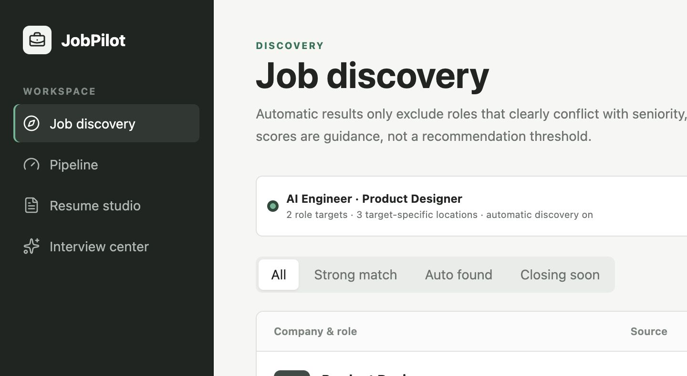
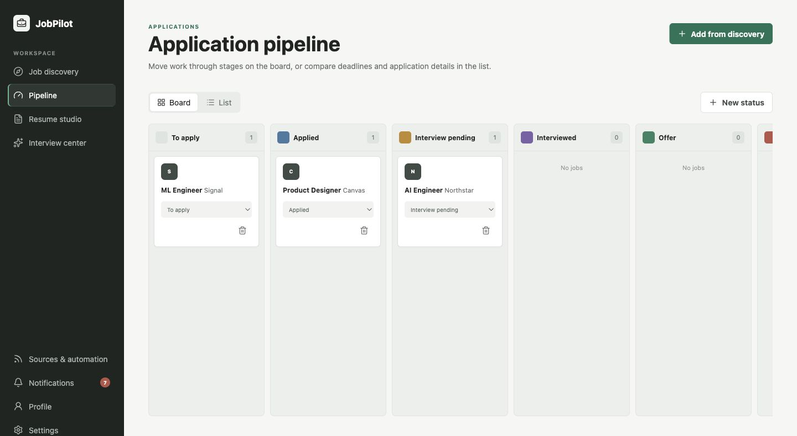
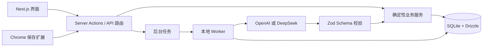

<div align="center">
  <h1>JobPilot</h1>
  <p><strong>本地优先的岗位发现、简历优化与求职进度工作台。</strong></p>
  <p>
    <a href="README.md">English</a>
    ·
    <a href="https://try-jobpilot.vercel.app">在线体验</a>
    ·
    <a href="#快速开始">快速开始</a>
    ·
    <a href="#隐私与-ai-边界">隐私说明</a>
    ·
    <a href="CONTRIBUTING.md">参与贡献</a>
  </p>
  <p>
    
    
    
    
    
  </p>
</div>



JobPilot 是一个开源、单用户、本地优先的求职管理 Web App。你可以在同一个工作区中导入或创建简历、设置多个相互独立的求职目标、发现与判断岗位、制作申请材料、准备面试，并记录完整的申请时间线。

即使不开启 AI，它依然可以作为简历编辑器和申请管理工具使用。开启 AI 后，所有模型请求都由 JobPilot 后端发起；模型只返回结构化建议，结果通过校验后才能由确定性业务代码写入系统。

> [!IMPORTANT]
> JobPilot 仍在积极开发中。升级前请备份 `data/` 文件夹，并在正式申请前人工核对所有 AI 生成内容。

> [!NOTE]
> 公开 `main` 分支是本地优先的单用户版本；`cloud` 分支用于[在线托管版 JobPilot](https://try-jobpilot.vercel.app)，并增加 Supabase 登录与私有存储、托管 libSQL、账户密钥加密、租户隔离任务队列和受限 Vercel Worker。部署说明见 [云端部署文档](docs/CLOUD_DEPLOYMENT.md)。

## 产品范围

第一版主路径刻意保持简单：可信简历 → 明确岗位目标 → 发现或导入岗位 → 判断匹配 → 逐条人工确认材料 → 跟进申请。简历编辑、手动岗位录入和申请管理不依赖 AI；公司研究、自动联网发现、双语同步、面试包和助手属于可选加速能力。JobPilot 不使用开放式自主申请 Agent，每个 AI 任务都有明确输入、Schema、Prompt 版本、持久化状态和人工确认点。

## 核心能力

| 工作流 | 已包含 |
| --- | --- |
| 岗位发现 | 手动添加、智能 URL 导入、公开网络搜索、公开 ATS 来源、自动去重、忽略规则和岗位有效性检查 |
| 求职偏好 | 创建多个独立岗位目标；每个目标分别设置职级、工作类型、地点、薪资、行业、公司、签证和硬性要求 |
| 简历工作室 | PDF/DOCX/TXT 导入、在线新建、结构化编辑、模块拖动排序、有限版本历史、恢复为新版本、预览和按版本导出 |
| AI 辅助 | 用户档案分析、基于证据的岗位匹配、简历润色与定制、中英文简历同步、中英文求职信和面试准备 |
| 申请进度 | 看板/表格双视图、自定义状态、日期、材料、面试、提醒和不可变事件时间线 |
| 浏览器保存 | 通过本地 Chrome 扩展把当前浏览的岗位页面保存到 JobPilot |
| 本地自动化 | 常驻 Worker 负责定时发现、ATS 刷新、有效性检查、搜索索引和应用内通知 |
| 使用体验 | 中英文切换、首次操作引导、响应式工作台和 JobPilot 助手 |

## 设计原则

### 先展示证据，再展示百分比

JobPilot 把确定性筛选与 AI 判断分开。明确命中公司黑名单、地点冲突等条件时，自动推荐可以被阻止；技能不足、经验不完全匹配、薪资缺失和签证信息不确定则会显示为差距或待确认项，而不是静默删除岗位。

### 岗位发现与申请进度分离

AI 找到和用户手动添加的岗位先进入“岗位发现”。只有用户决定加入后，岗位才进入申请进度。被忽略的岗位会在本地保留排除记录，防止后续搜索重复加入。



### 简历事实始终可追溯

上传原件永远不会被覆盖。每份简历保留平台首版和最近 9 版；仍被申请材料引用的版本不会被自动清理。每次编辑、恢复和 AI 调整都会先创建新版本，并发保存使用版本比较，旧页面或过期任务不能覆盖更新内容。AI 被明确禁止虚构公司、技能、成果和数字，但用户仍应逐项检查生成内容。

## 快速开始

### 环境要求

- Node.js 20.9 或更高版本
- npm 10 或更高版本
- macOS、Linux 或 Windows
- 可选：OpenAI 或 DeepSeek API Key，用于 AI 辅助功能

### 安装运行

```bash
git clone https://github.com/davinh47/JobPilot.git
cd JobPilot
npm install
cp .env.example .env.local
npm run db:setup
npm run dev
```

打开 [http://127.0.0.1:3000](http://127.0.0.1:3000)。

`npm run dev` 会同时启动 Next.js 和后台 Worker。首次打开会出现界面操作引导，也可以在设置中重新播放。

需要无个人信息的体验数据时，可在初始化后运行：

```bash
npm run db:demo
```

该命令可以重复执行，只会创建明确标注的虚构简历、岗位和申请记录。

### 配置 AI（可选）

1. 打开“设置”。
2. 选择 OpenAI 或 DeepSeek。
3. 选择模型和任务路由策略；默认使用“均衡”。
4. 填写 API Key、测试连接并开启 AI 辅助。

API Key 会写入本机的 `data/secrets.json`，文件权限设置为 `600`。Key 不会保存在浏览器状态中，也不会提交到 Git。“节省成本”“均衡”和“质量优先”会按任务复杂度自动路由；“固定”会让所有任务使用所选模型。

发布自己的分支时可设置 `NEXT_PUBLIC_GITHUB_URL`，让应用页脚指向正确的开源仓库。

| 模式 | 适合场景 | 网络岗位发现 |
| --- | --- | --- |
| 不开启 AI | 简历编辑、手动保存岗位、申请进度管理 | 手动录入和已配置的确定性来源 |
| OpenAI | 结构化分析和原生网络研究 | OpenAI Responses API Web Search |
| DeepSeek | 更注重成本的结构化分析和 DeepSeek V4 工作流 | DeepSeek 原生 Web Search |

模型、网络搜索和额度是否可用取决于对应提供商账户。JobPilot 不要求用户另外配置搜索 API Key。

## Chrome 一键保存

让 JobPilot 运行在 `3000` 端口，然后打开“设置 → Chrome 一键保存”：

1. 下载并解压扩展。
2. 打开 `chrome://extensions`。
3. 开启“开发者模式”，点击“加载已解压的扩展程序”。
4. 使用 JobPilot 页面提供的本地令牌完成一次配对。
5. 打开岗位详情页，点击 **Save to JobPilot**。

扩展使用 `activeTab` 权限，只有在用户主动点击保存时才读取当前页面；抓取内容只发送到本机 JobPilot。

## 系统架构



关系数据库是用户事实、偏好、岗位、申请和事件的权威来源。原始简历、JD、网页快照和生成材料都保留版本与来源。简历版本使用并发比较写入，并通过“首版 + 最近 9 版”的有限历史控制存储。AI 调用使用统一的 provider-neutral 边界、版本化 Prompt、任务分级模型路由、token 预算和用量记录；求职信与简历修改中的候选人事实必须映射到精确来源证据。

JobPilot 助手只使用有限对话上下文，不另建一套长期记忆：最近 10 轮用户/助手对话保留完整内容，更早轮次滚动压缩为一段有长度上限的摘要。摘要只用于继续理解当前任务，不会被当成简历事实证据；用户也可以在助手顶部随时清除对话。

### 目录结构

```text
src/app/           Next.js 页面、Server Actions 和 API 路由
src/components/    工作台组件与交互控件
src/db/            Drizzle Schema、迁移、Seed 和数据回填
src/lib/           业务逻辑、AI 适配、解析和导出
src/worker/        常驻本地后台 Worker
drizzle/           SQLite 版本化迁移
chrome-extension/  Chrome 一键保存扩展源码
public/downloads/  JobPilot 提供下载的扩展包
data/              本地数据库、上传文件和密钥（Git 已忽略）
```

## 隐私与 AI 边界

- 简历文件、SQLite 数据库和 API Key 保存在本机 `data/` 目录。
- 浏览器不会直接请求模型提供商。
- 开启 AI 后，相关简历/档案与岗位内容会发送给用户选择的模型提供商。
- 公开搜索 Query 会移除姓名、邮箱和电话号码等已知个人信息。
- JD 和网页内容视为不可信输入，其中的提示或指令不会被执行。
- 模型输出必须通过严格 Schema 校验，再由确定性服务写入数据库。
- 岗位有效状态和申请状态分开保存；岗位失效不会删除仍在进行中的申请。
- JobPilot 不会自动提交申请、发送邮件或替用户做职业决策。
- 默认不包含产品分析或第三方遥测。
- 设置页可以下载账户范围的 JSON 备份；API Key、扩展配对 token、限流状态、队列任务和派生搜索索引不会导出。

安全问题请参阅 [SECURITY.md](SECURITY.md)。

## 开发与验证

```bash
npm test
npm run typecheck
npm run lint
npm run build
```

其他常用命令：

```bash
npm run db:generate        # 生成 Drizzle 迁移
npm run db:migrate         # 执行待处理迁移
npm run db:seed            # 初始化本地用户和申请状态
npm run db:demo            # 可选的虚构产品体验数据
npm run worker:once        # 执行一轮 Worker
npm run extension:package  # 重新打包 Chrome 扩展
npm run resumes:verify-exports
```

提交 Pull Request 前请阅读 [CONTRIBUTING.md](CONTRIBUTING.md)。参与项目即表示同意遵守 [Code of Conduct](CODE_OF_CONDUCT.md)。

## 当前限制

- 暂不支持扫描图片型简历 OCR。
- 网络岗位发现取决于模型账户额度、功能可用性和当前网络。
- JSON 导出用于备份、审计和可移植性；暂未提供跨实例自动恢复。
- Cloud 在 libSQL 上采用应用层租户隔离，而不是数据库 RLS；新增查询时必须保留 ownership 校验和隔离测试。
- JobPilot 不会代替用户提交申请或发送邮件。

Roadmap 代表方向，不构成发布承诺。欢迎提交范围清晰的 Issue 与贡献。

## 许可证

JobPilot 使用 [MIT License](LICENSE) 开源。
